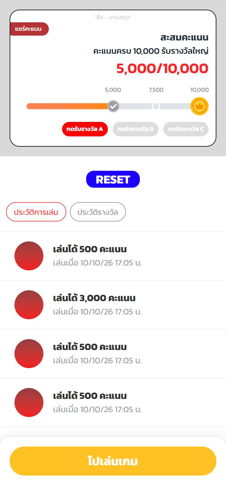
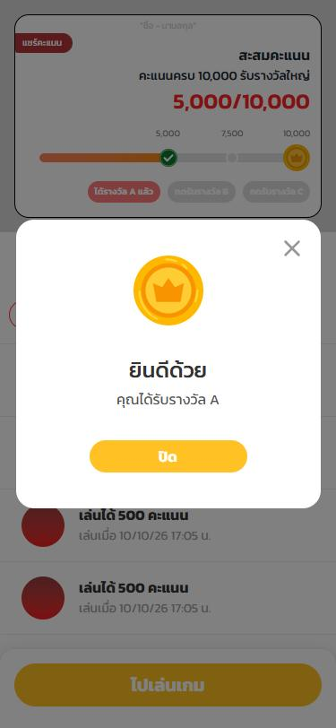
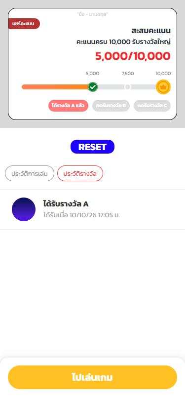
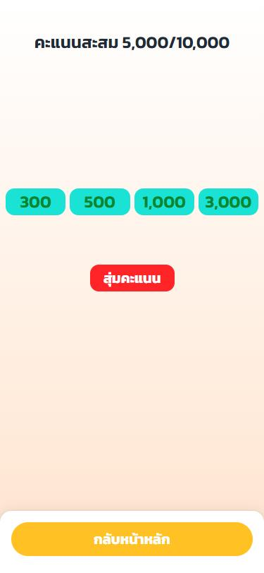
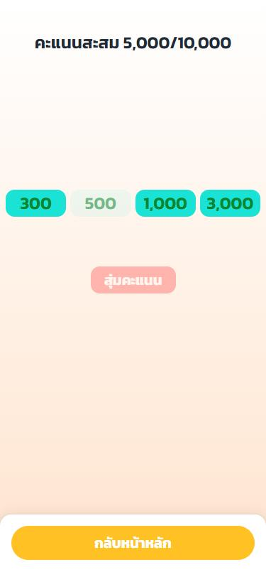
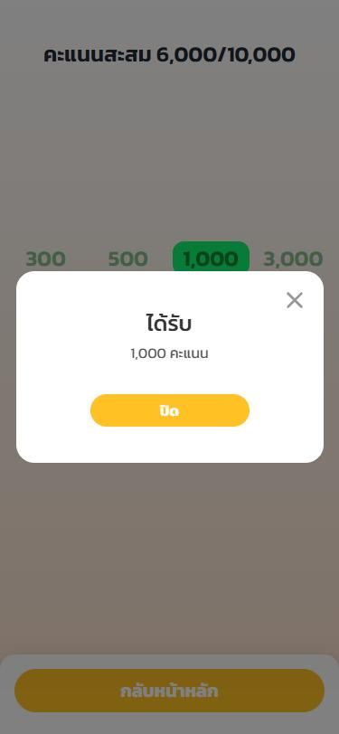

# Nextzy Points Game

**English** · [ภาษาไทย](README.th.md)

A small points game built as a full-stack take-home assignment. Players draw a random score, collect points up to 10,000, and claim rewards at 5,000, 7,500 and 10,000 points.

- **Live site:** https://games-nextzy.vercel.app
- **API:** https://nextzy-api.onrender.com (health check: [`/api/health`](https://nextzy-api.onrender.com/api/health))
- **API documentation and testing:** [Apidog](https://4cmxd1k8e7.apidog.io/)
- **Development log:** [docs/DEVELOPMENT_LOG.md](docs/DEVELOPMENT_LOG.md)

> The API runs on Render's free plan. It sleeps after 15 minutes without traffic, so the first request after that can take about a minute.

## Screenshots

|                                                      Home                                                       |                                               Reward claimed                                               |                                      Reward history                                       |
| :-------------------------------------------------------------------------------------------------------------: | :--------------------------------------------------------------------------------------------------------: | :---------------------------------------------------------------------------------------: |
|  |  |  |

|                                          Game                                          |                                               Drawing                                               |                                              Result                                               |
| :------------------------------------------------------------------------------------: | :-------------------------------------------------------------------------------------------------: | :-----------------------------------------------------------------------------------------------: |
|  |  |  |

All screenshots were taken at 375px on the deployed site.

## Features

- **Home:** total score, progress bar with three checkpoints, claim buttons, reset, and tabs for play history and reward history (paginated)
- **Game:** draws 300, 500, 1,000 or 3,000 points. The other options are eliminated one by one, then a dialog shows the result. You can play again without leaving the page.
- **Anonymous player:** no sign-up. The browser keeps an HttpOnly session cookie for 180 days.
- **Responsive:** designed for 300–500px phones and also works on tablets
- **Accessible:** native `<dialog>`, keyboard support, screen reader announcements and reduced motion

## Tech stack

| Area     | Tools                                                                              |
| -------- | ---------------------------------------------------------------------------------- |
| Web      | Next.js 16 (App Router), React 19, Tailwind CSS 4, TanStack Query 5                |
| API      | NestJS 12, Prisma 7 with the `pg` driver adapter, class-validator                  |
| Database | PostgreSQL (Supabase in production)                                                |
| Tests    | Vitest, Testing Library, Supertest against a real PostgreSQL database              |
| Tooling  | npm workspaces, TypeScript 6, ESLint (web), oxlint (API), Prettier, GitHub Actions |
| Hosting  | Vercel (web), Render (API), Supabase (database), all in Singapore                  |

## Architecture

```text
Browser ──► Next.js on Vercel ──/api/* rewrite──► NestJS on Render ──► PostgreSQL on Supabase
            (pages + proxy)                       (game rules, sessions)
```

- The browser only talks to the Next.js app. Next.js forwards `/api/*` to the API (`API_ORIGIN`), so the session cookie is first-party and is not blocked as a third-party cookie.
- The API decides every score. The web app only animates the result it receives, so the outcome cannot be changed from the browser.

```text
apps/
  api/                 NestJS API
    prisma/            schema and SQL migrations (with CHECK constraints)
    src/
      session/         anonymous session cookie and guard
      player/          progress (GET /api/me) and reset
      game/            play and history; domain/ holds the pure game rules
      reward/          checkpoint claims and reward history
      health/          health check
      common/          error format, validation, pagination
    test/              end-to-end tests against a test database
  web/                 Next.js app
    src/app/           home and /game pages
    src/components/    UI, home and game components
    src/lib/           API client, TanStack Query hooks, formatting
docs/                  screenshots and development log
render.yaml            Render blueprint for the API
```

### API

The [public Apidog documentation](https://4cmxd1k8e7.apidog.io/) includes all eight endpoints, request and response schemas, and a **Try it** panel connected to production. Call `POST /api/session` first and retain its session cookie when testing player endpoints. `GET /api/health` does not require a session. Reset deletes the current player's score and history, so use a separate test session.

All endpoints are under `/api`. Errors always use `{ "code": "...", "message": "..." }`, with Thai messages that the web app shows to the player.

| Method | Path                     | Description                                                          |
| ------ | ------------------------ | -------------------------------------------------------------------- |
| POST   | `/session`               | Creates or resumes the anonymous session and sets the cookie         |
| GET    | `/me`                    | Total score, progress version, score options and checkpoint statuses |
| POST   | `/me/reset`              | Clears score, rounds and claims, and starts a new progress version   |
| POST   | `/game-rounds`           | Draws a score (idempotent by `requestId`)                            |
| GET    | `/game-rounds`           | Play history (`page`, `limit`)                                       |
| POST   | `/checkpoints/:id/claim` | Claims a checkpoint reward                                           |
| GET    | `/reward-claims`         | Reward history (`page`, `limit`)                                     |
| GET    | `/health`                | Checks that the API can reach the database                           |

## Game rules

- Each round picks 300, 500, 1,000 or 3,000 with equal probability, using `crypto.randomInt` on the server.
- The total never exceeds 10,000. Near the cap only the remaining points are credited, and the result dialog shows both the score drawn and the points added.
- Checkpoints at 5,000, 7,500 and 10,000 can be claimed once each, in any order, once the total reaches them. Claiming does not deduct points.
- Reset sets the score to 0, deletes the play and reward history, and increments `progressVersion`. The session stays the same.

### Consistency decisions

- **Idempotent rounds:** each play sends a `requestId` (UUID). Retrying the same request returns the original round instead of adding points twice.
- **Progress version:** every play, claim and reset sends the `progressVersion` the page was showing. If another tab has reset in the meantime, the API answers `409 PROGRESS_VERSION_MISMATCH` and the page reloads the latest progress.
- **Row locking:** play and claim lock the player row (`SELECT … FOR UPDATE`), so concurrent requests cannot push the total past 10,000 or claim a reward twice.
- **Database constraints:** CHECK constraints and unique keys in the migrations enforce the score range and one claim per checkpoint, even if the application code had a bug.
- **Claim errors in a fixed order:** unknown checkpoint (404), stale version (409), not reached yet (`CHECKPOINT_LOCKED`, 409), already claimed (`REWARD_ALREADY_CLAIMED`, 409).
- **Timestamps in UTC:** the database connection forces `TimeZone=UTC`, and the web app formats times in Asia/Bangkok.

## Running locally

Requirements: Node.js 24 and a local PostgreSQL server (CI uses PostgreSQL 18).

```bash
npm ci
```

Create `apps/api/.env` from `apps/api/.env.example` and point `DATABASE_URL` at a local database, for example `nextzy_dev`. The web app's defaults work without a `.env` file.

```bash
npm run prisma:migrate:deploy -w api
```

```bash
npm run dev
```

Open http://localhost:3000. The API runs on http://localhost:3001.

## Tests and quality checks

```bash
npm run lint
```

```bash
npm run typecheck
```

```bash
npm test
```

```bash
npm run test:e2e -w api
```

```bash
npm run format:check
```

- **API unit tests:** game rules, error mapping, session tokens and configuration
- **API end-to-end tests:** every endpoint against a real PostgreSQL database, `nextzy_test` on the same server as `DATABASE_URL` (or `TEST_DATABASE_URL`). It is created and migrated automatically, and the tests refuse to run on a database whose name does not end in `_test`
- **Web tests:** components and hooks with Testing Library, including the play flow and error states

GitHub Actions runs format, lint, typecheck, unit, end-to-end and build on every pull request. It uses PostgreSQL 18 with the Asia/Bangkok time zone, so time zone bugs show up in CI.

## Deployment

| Part     | Where           | Settings                                                                                     |
| -------- | --------------- | -------------------------------------------------------------------------------------------- |
| Web      | Vercel          | Root directory `apps/web`, environment variable `API_ORIGIN=https://nextzy-api.onrender.com` |
| API      | Render (free)   | Blueprint in [`render.yaml`](render.yaml); `DATABASE_URL` is entered in the dashboard        |
| Database | Supabase (free) | Session pooler on port 5432; Data API disabled                                               |

Render's free plan has no pre-deploy step, so the API applies pending migrations with `prisma migrate deploy` when it starts.

### PageSpeed Insights (mobile)

| Performance | Accessibility | Best Practices | SEO |
| :---------: | :-----------: | :------------: | :-: |
|     97      |      96       |      100       | 100 |

The only accessibility finding is low contrast on some colours taken from the design. They were kept on purpose to match Figma.

## Known limitations

- The free API sleeps when idle, so the first request after that is slow.
- A player is tied to one browser. Clearing cookies starts a new player.
- "แชร์คะแนน" (share score) uses the Web Share API when the browser supports it, and otherwise copies the score text with the link.
